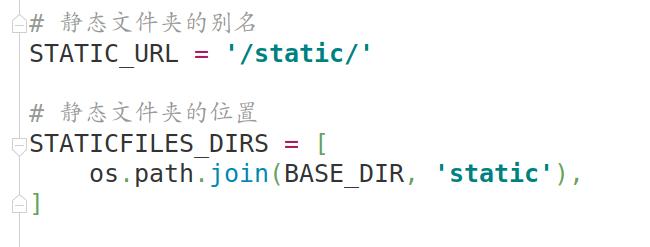
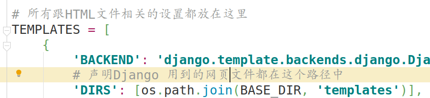
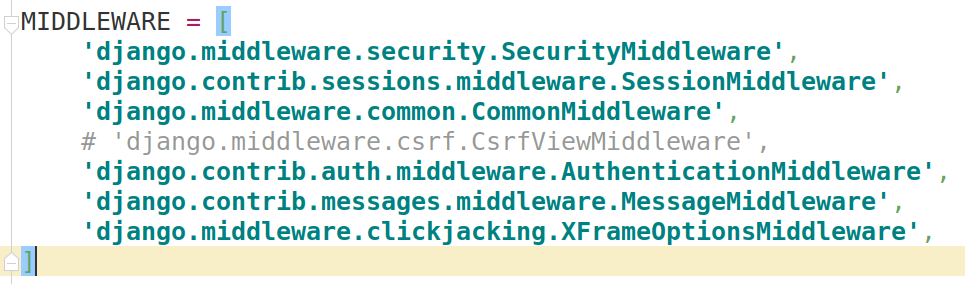
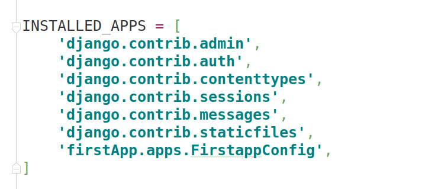
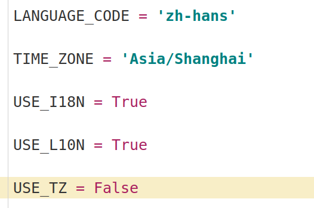

Django
===
## 基础操作
### 一、创建Django项目
```python
django-admin startproject firstDjango
```
### 二、创建APP应用程序
```python
python manage.py startapp firstApp
```
### 三、查看项目结构
```python
cd firstDjango/  # 首先进入项目
tree
.
| -- firstApp  # 应用程序包
|   | -- admin.py  # 它是我们的后台管理工具 , 后期我们的可以通过他管理我们的model和数据库
|   | -- apps.py  # 这个是django的生成app名称的文件
|   | -- | migrations  # 数据迁移包 , 他是负责迁移文件 , 生成数据库表数据 
|   |     | --  __init__.py  # 初始化文件 同样也标志我们的app可以被引用
|   | -- model.py  # 模型文件 里面放的都是数据库表的映射
|   | -- tests.py  # 测试文件
|   | -- views.py  # 视图函数文件
| -- firstDjango  # 项目的实际Python包
|    | -- __init__.py  # 一个空文件，告诉Python该目录应该被视为Python包
|    | -- settings.py  # 此Django项目的设置/配置
|    | -- urls.py  # 这个Django项目的URL声明; 您的Django支持的站点的＂目录＂
|    | -- wsgi.py  # 与WSGI兼容的Web服务器的入口点，用于为您的项目提供服务
| -- manage.py  # 一个命令行实用程序，允许您以各种方式与此Django项目进行交互
```
### 四、配置开发环境
* 配置静态文件地址
>1.在项目文件夹下创建文件夹-->static
>2.在配置文件 settings.py 中新增如下代码块

```python
# 静态文件夹的别名
STATIC_URL = '/static/'

# 静态文件夹的位置
STATICFILES_DIRS = [
    os.path.join(BASE_DIR, 'static'),
]
```



* 配置网页地址
>1.在项目文件夹下创建文件夹-->templates
>2.在配置文件中找到 TEMPLATES 中的 'DIRS'，具体配置如下

```python
'DIRS': [os.path.join(BASE_DIR, 'templates')],
```


* 注释错误提示
>在配置文件中找到 MIDDLEWARE 注释第四行(含有 csrf )

```python
MIDDLEWARE = [
    'django.middleware.security.SecurityMiddleware',
    'django.contrib.sessions.middleware.SessionMiddleware',
    'django.middleware.common.CommonMiddleware',
    # 'django.middleware.csrf.CsrfViewMiddleware',
    'django.contrib.auth.middleware.AuthenticationMiddleware',
    'django.contrib.messages.middleware.MessageMiddleware',
    'django.middleware.clickjacking.XFrameOptionsMiddleware',
]
```


* 注册APP
>在配置文件中找到 INSTALLED_APPS 在最后加上APP注册信息

```python
INSTALLED_APPS = [
	'firstApp.apps.FirstappConfig',  # name.apps.nameConfig(首字母大写，其余小写)
]
```



### 五、设置时区和语言格式
* 配置 settings.py 文件
* 找到以下变量
```python
	LANGUAGE_CODE = 'zh-hans'  # 设置显示格式为中文
	TIME_ZONE = 'Asia/Shanghai'  # 设置时区格式为上海
	USE_TZ = False  # 默认显示为 True 显示的是 UTC 时间，不是本地时间
```


### 六、启动服务

```python
python manage.py runserver [IP]:[端口]  # 地址参数和断开参数可以默认不写( 127.0.0.1:8080 )
```
